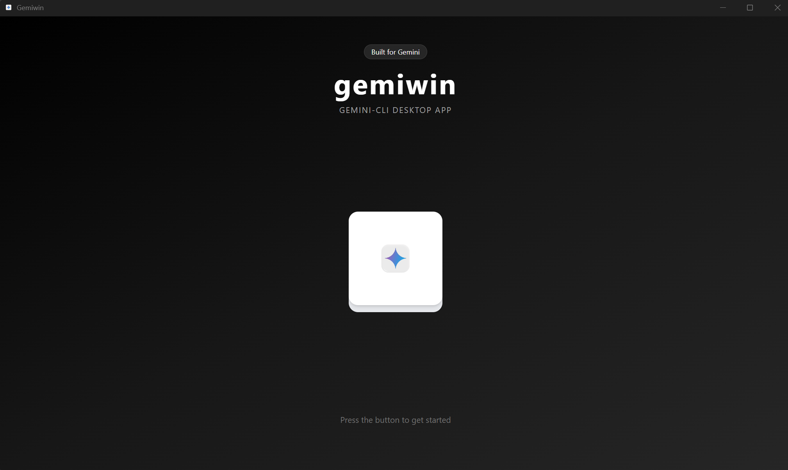
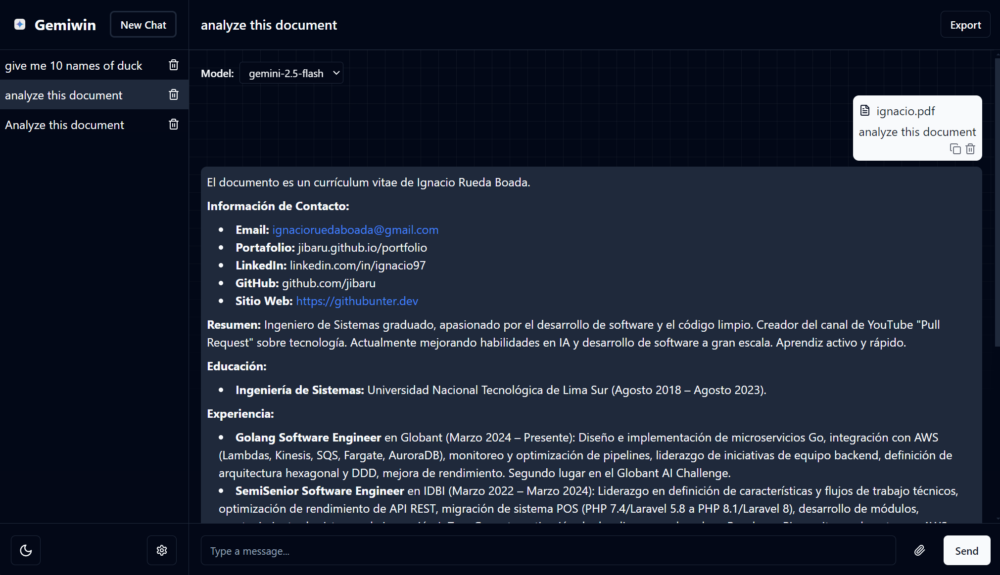

<p align="center">
  
  <h1 align="center">gemiwin</h1>
</p>

A **desktop chat application** that lets you converse with **Google Gemini** models — 100 % **locally**. Built with **Go, Electron, React, TypeScript & Tailwind CSS**.

---

## ✨ Key Features

- ⚡ **Multi-chat workflow** – create, switch and delete conversations instantly.
- 🔧 **Per-chat model switcher** – toggle between `gemini-2.5-flash` and `gemini-2.5-pro` on the fly.
- 📎 **File uploads** – attach Markdown, PDF or source-code files (< 1 MB) as extra context.
- 📝 **Rich Markdown rendering** with copy-to-clipboard.
- ⏱️ **Live streaming indicator** + cancel button.
- 🗑️ Delete individual messages or entire chats.
- 📤 **Export** any conversation as Markdown or PDF.
- 🌙 Light/Dark theme synced with system preference.
- 🚀 Cross-platform packaging via Electron Forge.
- 🔐 Everything stays on **your machine** – no external servers required.






## 🏗️ Architecture

```mermaid
graph TD
    subgraph Desktop
        A[Electron + React UI]
    end
    A -->|HTTP (REST)| B[(Go API server)]
    B --> C[Gemini CLI]
    B --> D[(Local filesystem)]
    C -->|Model response| B
    D -. stores .-> B
```

1. **Electron UI** renders the app and calls the local HTTP API.
2. The **Go server** forwards prompts to **Gemini CLI** and persists chat history & uploaded files under `api/data/`.
3. No data ever leaves your computer.

---

## 📚 Detailed Guides

- **API backend** – setup, endpoints & build instructions → [api/README.md](api/README.md)
- **Electron UI** – development workflow & packaging → [ui/README.md](ui/README.md)

