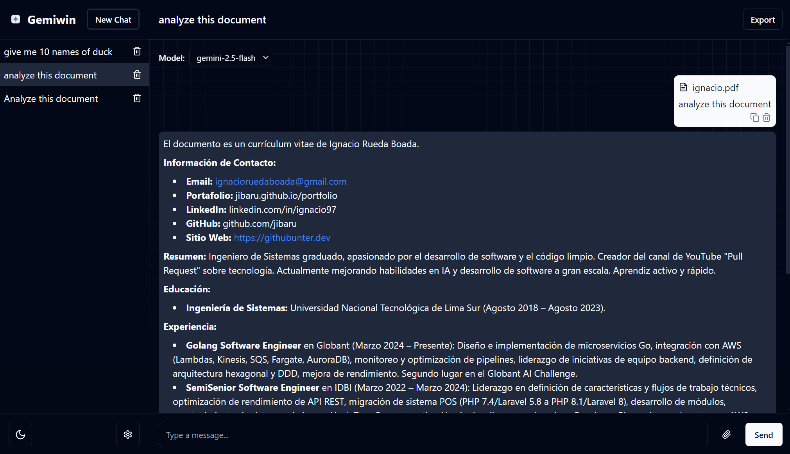

<p align="center">
  
  <h1 align="center">gemiwin</h1>
</p>

A modern desktop application that lets you converse with Google Gemini models straight from your computer. Built with Electron, React, TypeScript and Tailwind CSS for a smooth, native-feeling experience.

---

## ✨ Features

- ⚡ **Fast multi-chat workflow** – create, switch and delete conversations with a single click.
- 🔧 **On-the-fly model switcher** – toggle between `gemini-2.5-flash` and `gemini-2.5-pro` for each chat.
- 📎 **File uploads** – attach Markdown, PDF or source-code files (≤ 1 MB) to add extra context to your prompts.
- 📝 **Rich Markdown rendering** – code blocks, tables & more, plus handy copy-to-clipboard.
- ⏱️ **Live streaming indicator** with a cancel button – stop long-running requests whenever you like.
- 🗑️ Delete individual messages or entire chats.
- 📤 **Export** any conversation as Markdown or PDF.
- 🌙 **Light/Dark theme** toggle, synced with system preference.
- 🚀 **Cross-platform packaging** via Electron Forge (macOS, Windows, Linux).
- 🔐 **Secure & local** – your Gemini API key is stored only on your machine.





## ⚙️ Getting Started

### Prerequisites

- **Node.js** ≥ 18
- **npm** ≥ 9
- A running **Gemini backend** service reachable at `http://localhost:8080`.

> The UI expects the [gemini-cli](https://github.com/GoogleCloudPlatform/gemini-cli) server (or any compatible backend) exposing the REST endpoints listed below.

### Installation

```bash
# Clone repository
$ git clone https://github.com/<your-username>/gemiwin.git
$ cd gemiwin/ui

# Install dependencies
$ npm install

# Launch in development mode (with hot reload)
$ npm run start
```

The Electron window will open automatically.

### Packaging a distributable

```bash
# Build platform-specific installer (macOS, Windows, Linux)
$ npm run make
```

Generated installers can be found inside the `out/` directory.

---

## 🔑 Configuration

Providing a **Gemini API key** unlocks higher-quota usage, but it's **optional** – if omitted, Gemiwin will fall back to the default quotas bundled with `gemini-cli`.

1. Click the *cog* icon in the sidebar.
2. Paste your key into the “Gemini API Key” field (or leave blank).
3. Hit **Save** – the key is stored only on your machine.

The model used by the conversation can be changed at any moment via the dropdown inside the chat view.

---

Gemiwin communicates **locally** with a lightweight backend that wraps [gemini-cli](https://github.com/GoogleCloudPlatform/gemini-cli). No external services are required – everything stays on your machine.
